

# How to solve the Rubik's cube
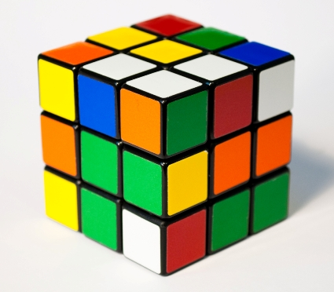

# Why?
Everyone **CAN** and **SHOULD** solve the cube **at least once** in their lifetime.  
 
- Impress your friends and family
- Soul-mate bait 

- Stress relief
- Exercise your brain
- Win prizes!!!

# I don't think I have what it takes
- 43,252,003,274,489,856,000 possible permutations

- God can solve it with less than 20 moves everytime!

- It took 35 CPU-years of idle computer time (donated by Google) to prove God's Number!
- **Why are you so intimidated!!!**

# What you need  
- A 3x3x3 Rubik's cube
- Passion for learning
- Tolerance for mistakes
- Memory (memory is a muscle, exercise it!)
- Spacial awareness (comes w/ practice)

# What I'll Cover   
- A way to solve the cube
- Optimized for ease of memory
- Memorization tips & tricks
- Motivation and inspiration

# What I Won't Cover
- How to solve for speed
- How to win at life with cube solving skills

# Tiers of Memorization 
## As-is Memory 
Remembering things as they are without an association, visual queue, or muscle memory:  

- Volatile, can easily be forgotten if not used frequently
- Examples: 
    - remembering phone numbers, SSN, passwords
    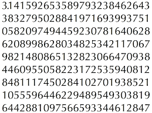

## Associative Memory 
Aiding memorization by linking a related or unrelated idea to the item needing remembering.

- Less volatile when one or more items are associated to a memory
- Use Acronyms or Mnemonics
- Memory Palace
- Examples: 
    - Musical notes on lines of treble staff: Every Good Boy Does Fine
    - Musical notes between lines of treble staff: F A C E
    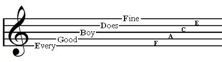
    - Remembering days in month with knuckles  
    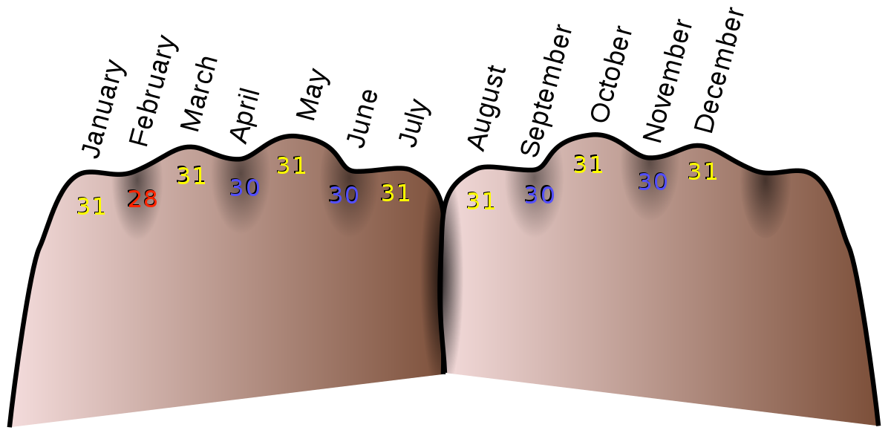
    
## Visual Memory 
Using visual queues to trigger a memory or response

- Pictures are worth a thousand *memories*
- Icons, Logos, Colors, Patterns, Shapes
- Examples:
    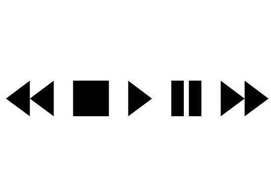
    
    
    - Toddlers can't read but...
    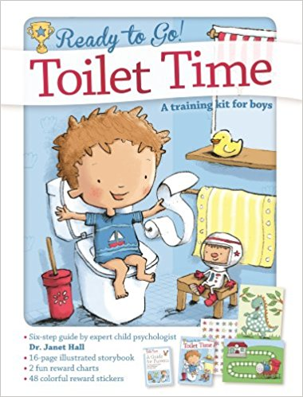

## Muscle Memory 
Recalling repetitive movements and responses with little to no concious effort

- Body can auto *magically* establish memory w/ repetitive tasks
- (work + patience + pain + rest) X repeat = Profit
- Examples
    - Driving a car
    - Typing
    - Throwing / Catching a ball
    - Playing an instrument 

# Let's Get Started!
# Terms and Vocabulary
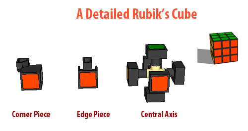

## Centers
<iframe height="150" width="250px" scrolling="no" frameborder="0" src="https://rubiks3x3.com/algorithm/?fields=ddddnddddddddnddddddddnddddddddnddddddddnddddddddndddd&sett=000010&bg=FFFFFF"></iframe> 
## Edges
<iframe height="150" width="250px" scrolling="no" frameborder="0" src="https://rubiks3x3.com/algorithm/?fields=dndndndnddndndndnddndndndnddndndndnddndndndnddndndndnd&sett=000010&bg=FFFFFF"></iframe> 
## Corners
<iframe height="150" width="250px" scrolling="no" frameborder="0" src="https://rubiks3x3.com/algorithm/?fields=ndndddndnndndddndnndndddndnndndddndnndndddndnndndddndn&sett=000010&bg=FFFFFF"></iframe> 
## Layers

    <iframe height="150" width="250px" scrolling="no" frameborder="0" src="https://rubiks3x3.com/algorithm/?fields=dddddddddnnnddddddnnnddddddnnnddddddnnnddddddddddddddd&sett=000010&bg=FFFFFF"></iframe>
    <iframe height="150" width="250px" scrolling="no" frameborder="0" src="https://rubiks3x3.com/algorithm/?fields=ddddddddddddnnnddddddnnnddddddnnnddddddnnndddddddddddd&sett=000010&bg=FFFFFF"></iframe> 
    <iframe height="150" width="250px" scrolling="no" frameborder="0" src="https://rubiks3x3.com/algorithm/?fields=dddddddddddddddnnnddddddnnnddddddnnnddddddnnnddddddddd&sett=000010&bg=FFFFFF"></iframe> 

## Faces

    <iframe height="150" width="250px" scrolling="no" frameborder="0" src="https://rubiks3x3.com/algorithm/?scheme=nddddd&sett=000010&bg=FFFFFF"></iframe> 
    <iframe height="150" width="250px" scrolling="no" frameborder="0" src="https://rubiks3x3.com/algorithm/?scheme=dddndd&sett=000010&bg=FFFFFF"></iframe> 
    <iframe height="150" width="250px" scrolling="no" frameborder="0" src="https://rubiks3x3.com/algorithm/?scheme=ddnddd&sett=000010&bg=FFFFFF"></iframe> 

## Techniques
**Conscious** moves made to manipulate the cube in a **logical** manner
## Algorithms
A sequence of moves designed to manipulate the cube in a **specific** way  

- Often executed **unconsciously** from memory  
- Not incredibly obvious (magic moves)  
- Don't try to understand how it works, just do it  

### Algorithm Example
<iframe height="270" width="300px" scrolling="no" frameborder="0" src="https://rubiks3x3.com/algorithm/?moves=UuDdLlRrFfBb00&scheme=wrbogy&sett=001110"></iframe> 

# The Approach  

- [Top Layer](#top-layer)  
    - [Top Edges](#top-edges)  
    - [Top Corners](#top-corners)
- [Middle Layer](#middle-layer)
    - [Middle Edges](#middle-edges) 
- [Bottom Layer](#bottom-layer)
    - [Orient Bottom Edges](#orient-bottom-edges)
    - [Position Bottom Corners](#position-bottom-corners)
    - [Orient Bottom Corners](#orient-bottom-corners)
    - [Position Bottom Edges](#position-bottom-edges)

## Top Layer
### Top Edges
<iframe height="270" width="300px" scrolling="no" frameborder="0" src="https://rubiks3x3.com/algorithm/?fields=dwdwwwdwddrddrdddddbddbdddddoddodddddgddgddddddddddddd&sett=010110"></iframe> 
#### Techniques

    <iframe height="270" width="280px" scrolling="no" frameborder="0" src="https://rubiks3x3.com/algorithm/?moves=0&fields=dwdwwwdwddrddrdddddbddbdddddoddodddddgddgddddddddddddd&initrevmove=0&sett=011010"></iframe> 
    <iframe height="270" width="280px" scrolling="no" frameborder="0" src="https://rubiks3x3.com/algorithm/?moves=FrdR0&fields=dwdwwwdwddrddrdddddbddbdddddoddodddddgddgddddddddddddd&initrevmove=FrdR0&sett=011010"></iframe>  
    <iframe height="270" width="280px" scrolling="no" frameborder="0" src="https://rubiks3x3.com/algorithm/?moves=0D3d0&fields=dwdwwwdwddrddrdddddbddbdddddoddodddddgddgddddddddddddd&initrevmove=0D3d0&sett=011010"></iframe> 

### Top Corners
<iframe height="270" width="300px" scrolling="no" frameborder="0" src="https://rubiks3x3.com/algorithm/?fields=wwwwwwwwwrrrdrddddbbbdbddddooododdddgggdgddddddddddddd&sett=010010"></iframe> 
#### Techniques

    <iframe height="270" width="280px" scrolling="no" frameborder="0" src="https://rubiks3x3.com/algorithm/?moves=rdRDrdR&fields=dwdwwwdwbdrddrdddddbodbddddwoddodddddgddgddddddddddddd&sett=011010"></iframe>  
    <iframe height="270" width="280px" scrolling="no" frameborder="0" src="https://rubiks3x3.com/algorithm/?moves=FDfdFDf&fields=dwdwwwdwodrddrdddddbwdbddddboddodddddgddgddddddddddddd&sett=011010"></iframe>
    <iframe height="270" width="280px" scrolling="no" frameborder="0" src="https://rubiks3x3.com/algorithm/?moves=rdR&fields=dwdwwwdwwdrddrdddddbgdbddddroddodddddgddgddddddddddddd&sett=011010&bg=DDDDDD"></iframe>   

## Middle Layer 
### Middle Edges
<iframe height="270" width="300px" scrolling="no" frameborder="0" src="https://rubiks3x3.com/algorithm/?fields=wwwwwwwwwrrrrrrdddbbbbbbdddoooooodddggggggdddddddddddd&sett=010010"></iframe>
#### Algorithms

    

        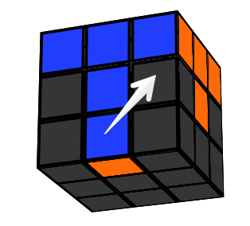
        
D' R' D R F' R F R'

    

    <iframe height="270" width="280px" scrolling="no" frameborder="0" src="https://rubiks3x3.com/algorithm/?moves=drDRfRFr&fields=wwwwwwwwwrrrdrddddbbbdbddbdooododdddgggdgdddddoddddddd"></iframe> 
    <iframe height="270" width="280px" scrolling="no" frameborder="0" src="https://rubiks3x3.com/algorithm/?moves=drDRfRFr5&fields=wwwwwwwwwrrrdrddddbbbdbodydoooboddddgggdgdddddrddddddd"></iframe> 

---

    

        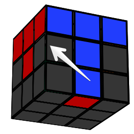
        
D L D' L' F L' F' L

    

    <iframe height="270" width="280px" scrolling="no" frameborder="0" src="https://rubiks3x3.com/algorithm/?moves=DLdlFlfL&fields=wwwwwwwwwrrrdrddddbbbdbddbdooododdddgggdgdddddrddddddd"></iframe> 
    <iframe height="270" width="280px" scrolling="no" frameborder="0" src="https://rubiks3x3.com/algorithm/?moves=DLdlFlfL5&fields=wwwwwwwwwrrrdrbdddbbbrbddydooododdddgggdgdddddrddddddd"></iframe> 

## Bottom Layer
### Orient Bottom Edges
<iframe height="270" width="300px" scrolling="no" frameborder="0" src="https://rubiks3x3.com/algorithm/?fields=dydyyydyddddggggggdddoooooodddbbbbbbdddrrrrrrwwwwwwwww&sett=010010"></iframe> 

If you already have a yellow cross, then move on to [Orient Bottom Corners](#orient-bottom-corners).  Otherwise run the algorithms associated with the below patterns that match your cube's state.

#### Algorithms

    

        
F U R U' R' F'

    

    
#1

    <iframe height="270" width="280px" scrolling="no" frameborder="0" src="https://rubiks3x3.com/algorithm/?moves=FURurf&fields=dydyydddddddggggggdydoooooodydbbbbbbdddrrrrrrwwwwwwwww"></iframe> 
    
#2

    <iframe height="270" width="280px" scrolling="no" frameborder="0" src="https://rubiks3x3.com/algorithm/?moves=FURurfU&fields=ddddydddddydggggggdydoooooodydbbbbbbdydrrrrrrwwwwwwwww"></iframe> 

---

    

        
F R U R' U' F'

    

    
#3

    <iframe height="270" width="280px" scrolling="no" frameborder="0" src="https://rubiks3x3.com/algorithm/?moves=FRUruf&fields=dddyyyddddddggggggdydoooooodddbbbbbbdydrrrrrrwwwwwwwww"></iframe>  

### Position Bottom Corners

    

        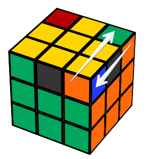
        
L U' R' U L' U' R U2

    

    <iframe height="270" width="280px" scrolling="no" frameborder="0" src="https://rubiks3x3.com/algorithm/?moves=yLurUluR4&fields=yyryyyyyggdoggggggbdoooooooydybbbbbbbdrrrrrrrwwwwwwwww"></iframe> 

### Orient Bottom Corners
Run algorithm associated with the following patterns (#1, #2, or #3).  If there is no match, repeat algorithm for #1 until there is a match and then run the algorithm associated to that match. Should not have to repeat more than 4 times.

#### Algorithms

    

        
R U R' U R U2 R' U2

    

    
#1

    <iframe height="270" width="280px" scrolling="no" frameborder="0" src="https://rubiks3x3.com/algorithm/?moves=RUrUR4r4&fields=dydyyyyyddddggggggddyooooooddybbbbbbddyrrrrrrwwwwwwwww"></iframe> 
    
No Match

    <iframe height="270" width="280px" scrolling="no" frameborder="0" src="https://rubiks3x3.com/algorithm/?moves=RUrUR4r4RUrUR4r4&fields=yydyyyyyddddggggggddyoooooodddbbbbbbyddrrrrrrwwwwwwwww"></iframe>  

---

    

        
R' U' R U' R' U2 R U2

    

    
#2

    <iframe height="270" width="280px" scrolling="no" frameborder="0" src="https://rubiks3x3.com/algorithm/?moves=ruRur4R4&fields=yydyyydyddddggggggyddooooooyddbbbbbbyddrrrrrrwwwwwwwww"></iframe> 
    
#3

    <iframe height="270" width="280px" scrolling="no" frameborder="0" src="https://rubiks3x3.com/algorithm/?moves=ruRur4R4Y&fields=dyyyyyyyddddggggggdddooooooyddbbbbbbddyrrrrrrwwwwwwwww"></iframe> 

### Position Bottom Edges
<iframe height="270" width="280px" scrolling="no" frameborder="0" src="https://rubiks3x3.com/algorithm/?sett=010010"></iframe> 

#### Algorithms

    

        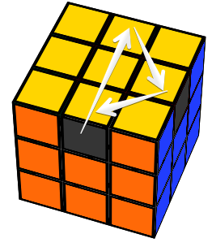
        
R2 U F B' R2 F' B U R2
 
    
 
    <iframe height="270" width="280px" scrolling="no" frameborder="0" src="https://rubiks3x3.com/algorithm/?moves=3UFb3fBU3&fields=yyyyyyyyygggggggggorooooooobobbbbbbbrbrrrrrrrwwwwwwwww"></iframe> 
    <iframe height="270" width="280px" scrolling="no" frameborder="0" src="https://rubiks3x3.com/algorithm/?moves=3UFb3fBU3Y3UFb3fBU3&fields=yyyyyyyyygrgggggggobooooooobobbbbbbbrgrrrrrrrwwwwwwwww"></iframe>

---

    

        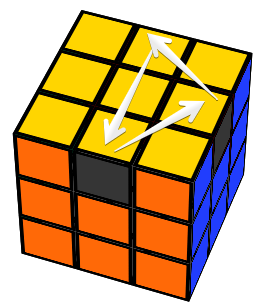
        
R2 U' F B' R2 F' B U' R2

    
 
    <iframe height="270" width="300px" scrolling="no" frameborder="0" src="https://rubiks3x3.com/algorithm/?moves=3uFb3fBu3&fields=yyyyyyyyygggggggggobooooooobrbbbbbbbrorrrrrrrwwwwwwwww"></iframe> 

# Congratulations

# What's Next
Keep practicing.  Once you've *installed* to muscle memory then you've achieved awesomeness, and now it's time to show off to your friends and family.

Need more of a challenge?

## Professor Cube (5x5x5) (7x7x7) (oddxoddxodd)  
- Solve the centers (technique)
- Pair the edges (technique)
- algorithm to swap last two edges
- It's a 3x3x3!

## Rubik's Revenge (4x4x4) (6x6x6) (evenxevenxeven)
- Gotta know adjacent colors: top=white; bottom=yellow; **B O** o **G** e **R**
- Solve the centers (technique)
- Pair the edges (technique)
- algorithm to swap last two edges
- It's a 3x3x3
- WAIT! WHAT THE... Parity cases!!!

## Go for speed
- Get a speed cube
- Learn fancy flipping techniques
- More techniques, More algorithms, More patterns to remember, More spacial awareness
- Practice solving with different colors as starting point
- Achieve sub 15 seconds to be scary cool
- Current world record: **4.59 seconds**

# Motivating or Discouraging?

